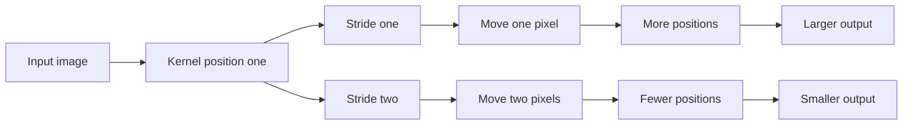
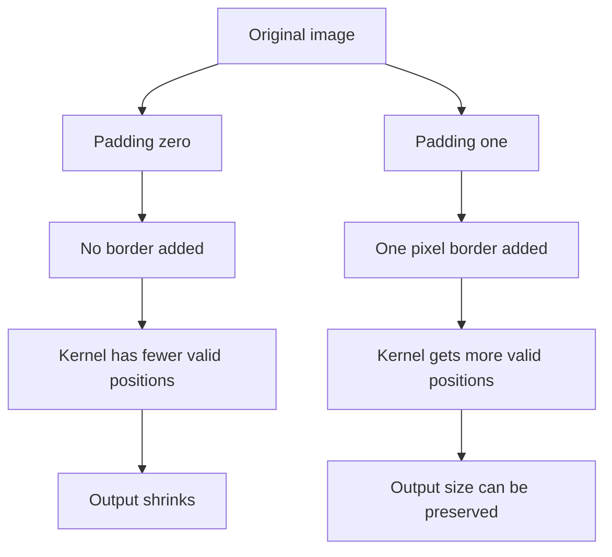
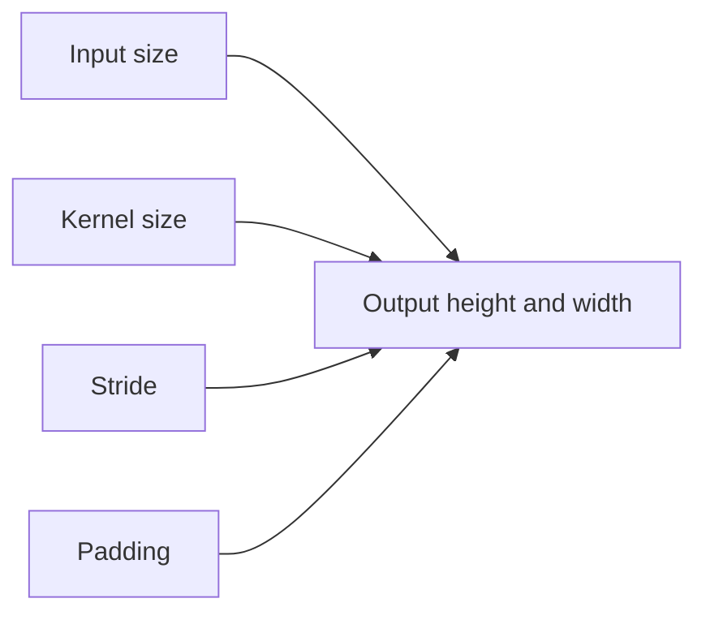

# Week 11 — Day 4
## Convolution Math: Stride, Padding, and Output Shape

## 📚 Topics

1. Review of convolution intuition from Day 3
2. Why convolution output height and width can change
3. Kernel size and valid sliding positions
4. Stride intuition
5. Padding intuition
6. Output-size formula for convolution
7. PyTorch `nn.Conv2d` examples
8. Common shape mistakes with stride and padding

<br>

---

<br>

## 🎯 Learning Goals

By the end of **Week 11, Day 4**, we should be able to:

1. Explain why convolution can shrink image height and width.
2. Understand what `kernel_size` controls.
3. Understand what `stride` controls.
4. Understand what `padding` controls.
5. Calculate simple convolution output sizes.
6. Predict output shapes from `nn.Conv2d`.
7. Explain why padding can preserve spatial size.
8. Recognize common convolution shape bugs.

<br>

---

<br>

# 1. 🔁 Review From Day 3

In Day 3, we learned that a convolution layer uses small learnable filters to scan across an image.

A filter/kernel looks at one local patch at a time.

For example, a `3 × 3` kernel looks at:

```text
3 rows × 3 columns
```

At each position, the kernel produces one output value.

After scanning the image, those output values form a feature map.

The key Day 3 idea was:

```text
A convolution layer uses learnable filters to scan local image patches and create feature maps.
```

Day 4 focuses on one important question:

```text
How do we calculate the output height and width?
```

<br>

---

<br>

# 2. 🧠 Core Concept: Output Size Depends on Sliding Positions

A convolution output is created by sliding a kernel across the input.

Each valid kernel position creates one output value.

So the output size depends on:

```text
How many valid positions can the kernel take?
```

If the kernel can fit in 26 positions across the height, the output height is 26.

If the kernel can fit in 26 positions across the width, the output width is 26.

That is why:

```text
28 × 28 input
3 × 3 kernel
no padding
stride 1
```

creates:

```text
26 × 26 output
```

<br>

---

<br>

# 3. 🔢 Kernel Size

`kernel_size` controls how large the local scanning window is.

Examples:

```python
kernel_size=3
```

means:

```text
3 × 3 kernel
```

```python
kernel_size=5
```

means:

```text
5 × 5 kernel
```

A larger kernel looks at a larger local region.

For example:

```text
3 × 3 kernel → small local region
5 × 5 kernel → larger local region
```

But with no padding, larger kernels shrink the output more.

<br>

---

<br>

# 4. 🪜 Stride

`stride` controls how far the kernel moves each step.

If:

```python
stride=1
```

then the kernel moves one pixel at a time.

```text
position 1 → move 1 pixel → position 2 → move 1 pixel → position 3
```

If:

```python
stride=2
```

then the kernel moves two pixels at a time.

```text
position 1 → move 2 pixels → position 2 → move 2 pixels → position 3
```

So larger stride usually creates smaller output height and width.

Simple intuition:

```text
stride 1 = scan carefully
stride 2 = skip more positions
```

<br>

---

<br>

# 5. 🧱 Padding

`padding` adds extra border pixels around the image.

Usually, those added pixels are zeros.

If we have a `28 × 28` image and use:

```python
padding=1
```

we add one pixel of padding around every side.

Height becomes:

```text
28 + 1 top + 1 bottom = 30
```

Width becomes:

```text
28 + 1 left + 1 right = 30
```

So the kernel sees the input as:

```text
30 × 30
```

Padding helps control shrinking.

For a `3 × 3` kernel with `stride=1`, `padding=1` keeps the output size the same:

```text
28 × 28 → 28 × 28
```

<br>

---

<br>

# 6. 🧭 Visual Intuition: Stride and Padding

## 6.1 Stride Visual

Stride controls how far the kernel moves each step.



Simple interpretation:

```text
stride = 1 → kernel moves slowly → more positions → larger output
stride = 2 → kernel skips more → fewer positions → smaller output
```

<br>

## 6.2 Padding Visual

Padding adds a border around the image before the kernel scans it.



Simple interpretation:

```text
padding = 0 → no border added → output shrinks
padding = 1 → border added → output size can be preserved
```

<br>

## 6.3 Combined Mental Model



The key idea:

```text
kernel_size, stride, and padding decide how many valid sliding-window positions exist.
```

<br>

---

<br>

# 7. 🧮 Output Size Formula

For one spatial dimension, the convolution output size is:

```text
output_size = floor((input_size + 2 × padding - kernel_size) / stride) + 1
```

We use the same formula separately for height and width.

For height:

```text
output_height = floor((input_height + 2 × padding - kernel_size) / stride) + 1
```

For width:

```text
output_width = floor((input_width + 2 × padding - kernel_size) / stride) + 1
```

For most of our early examples, height and width are the same, so the math is repeated twice.

<br>

---

<br>

# 8. 🧮 Example 1: No Padding, Stride 1

Input:

```text
28 × 28
```

Convolution settings:

```python
kernel_size=3
stride=1
padding=0
```

Formula:

```text
output_size = floor((28 + 2×0 - 3) / 1) + 1
```

Step by step:

```text
= floor((28 - 3) / 1) + 1
= floor(25 / 1) + 1
= 25 + 1
= 26
```

So output is:

```text
26 × 26
```

<br>

---

<br>

# 9. 🧮 Example 2: Padding 1, Stride 1

Input:

```text
28 × 28
```

Convolution settings:

```python
kernel_size=3
stride=1
padding=1
```

Formula:

```text
output_size = floor((28 + 2×1 - 3) / 1) + 1
```

Step by step:

```text
= floor((28 + 2 - 3) / 1) + 1
= floor(27 / 1) + 1
= 27 + 1
= 28
```

So output is:

```text
28 × 28
```

This is why `padding=1` is commonly used with a `3 × 3` kernel when we want to preserve height and width.

<br>

---

<br>

# 10. 🧮 Example 3: No Padding, Stride 2

Input:

```text
28 × 28
```

Convolution settings:

```python
kernel_size=3
stride=2
padding=0
```

Formula:

```text
output_size = floor((28 + 2×0 - 3) / 2) + 1
```

Step by step:

```text
= floor((28 - 3) / 2) + 1
= floor(25 / 2) + 1
= floor(12.5) + 1
= 12 + 1
= 13
```

So output is:

```text
13 × 13
```

Stride 2 makes the output smaller because the kernel skips more positions.

<br>

---

<br>

# 11. 🔗 Connecting to `nn.Conv2d`

Example 1:

```python
import torch
import torch.nn as nn

images = torch.randn(4, 1, 28, 28)

conv = nn.Conv2d(
    in_channels=1,
    out_channels=8,
    kernel_size=3,
    stride=1,
    padding=0
)

output = conv(images)
print(output.shape)
```

Expected output:

```text
torch.Size([4, 8, 26, 26])
```

Meaning:

```text
4 = batch size stays the same
8 = number of filters / output channels
26 = output height
26 = output width
```

<br>

---

<br>

# 12. 💻 PyTorch Example: Padding Preserves Size

```python
import torch
import torch.nn as nn

images = torch.randn(4, 1, 28, 28)

conv = nn.Conv2d(
    in_channels=1,
    out_channels=8,
    kernel_size=3,
    stride=1,
    padding=1
)

output = conv(images)
print(output.shape)
```

Expected output:

```text
torch.Size([4, 8, 28, 28])
```

Why?

```text
kernel_size=3
padding=1
stride=1
```

Using the formula:

```text
floor((28 + 2×1 - 3) / 1) + 1 = 28
```

So the spatial size stays:

```text
28 × 28
```

<br>

---

<br>

# 13. 💻 PyTorch Example: Stride Reduces Size

```python
import torch
import torch.nn as nn

images = torch.randn(4, 1, 28, 28)

conv = nn.Conv2d(
    in_channels=1,
    out_channels=8,
    kernel_size=3,
    stride=2,
    padding=0
)

output = conv(images)
print(output.shape)
```

Expected output:

```text
torch.Size([4, 8, 13, 13])
```

Why?

```text
floor((28 + 2×0 - 3) / 2) + 1
= floor(25 / 2) + 1
= 12 + 1
= 13
```

So:

```text
28 × 28 → 13 × 13
```

<br>

---

<br>

# 14. 🧩 Output Shape Pattern

For `nn.Conv2d`, input shape is:

```text
[N, C_in, H_in, W_in]
```

Output shape is:

```text
[N, C_out, H_out, W_out]
```

Where:

```text
N stays the same
C_out = out_channels
H_out is calculated using the formula
W_out is calculated using the formula
```

Example:

```python
nn.Conv2d(in_channels=1, out_channels=8, kernel_size=3)
```

Input:

```text
[4, 1, 28, 28]
```

Output:

```text
[4, 8, 26, 26]
```

<br>

---

<br>

# 15. ⚠️ Common Shape Mistakes

## Mistake 1: Forgetting That Padding Is Added on Both Sides

If:

```python
padding=1
```

then total padding added to one dimension is:

```text
1 left + 1 right = 2
```

or:

```text
1 top + 1 bottom = 2
```

That is why the formula uses:

```text
2 × padding
```

<br>

## Mistake 2: Thinking `out_channels` Changes Height and Width

`out_channels` controls the number of filters.

It changes the channel dimension of the output.

It does not directly calculate height and width.

Height and width are controlled by:

```text
input size
kernel size
stride
padding
```

<br>

## Mistake 3: Forgetting the Floor

When stride does not divide evenly, PyTorch uses the floor result.

Example:

```text
25 / 2 = 12.5
floor(12.5) = 12
```

Then:

```text
12 + 1 = 13
```

<br>

## Mistake 4: Flattening Before Convolution

Before `nn.Conv2d`, we need:

```text
[N, C, H, W]
```

Not:

```text
[N, features]
```

Flattening usually happens later, before the final fully connected classifier.

<br>

---

<br>

# 16. 💻 Full Practice Code

```python
import torch
import torch.nn as nn

images = torch.randn(4, 1, 28, 28)

print("Input shape:", images.shape)
print()

# --------------------------------------------------
# 1. No padding, stride 1
# --------------------------------------------------

conv1 = nn.Conv2d(
    in_channels=1,
    out_channels=8,
    kernel_size=3,
    stride=1,
    padding=0
)

out1 = conv1(images)
print("kernel=3, stride=1, padding=0:", out1.shape)

# --------------------------------------------------
# 2. Padding 1, stride 1
# --------------------------------------------------

conv2 = nn.Conv2d(
    in_channels=1,
    out_channels=8,
    kernel_size=3,
    stride=1,
    padding=1
)

out2 = conv2(images)
print("kernel=3, stride=1, padding=1:", out2.shape)

# --------------------------------------------------
# 3. No padding, stride 2
# --------------------------------------------------

conv3 = nn.Conv2d(
    in_channels=1,
    out_channels=8,
    kernel_size=3,
    stride=2,
    padding=0
)

out3 = conv3(images)
print("kernel=3, stride=2, padding=0:", out3.shape)

# --------------------------------------------------
# 4. Color image example
# --------------------------------------------------

color_images = torch.randn(10, 3, 64, 64)

color_conv = nn.Conv2d(
    in_channels=3,
    out_channels=16,
    kernel_size=3,
    stride=1,
    padding=1
)

color_out = color_conv(color_images)
print("Color output shape:", color_out.shape)
```

Expected output shapes:

```text
torch.Size([4, 8, 26, 26])
torch.Size([4, 8, 28, 28])
torch.Size([4, 8, 13, 13])
torch.Size([10, 16, 64, 64])
```

<br>

---

<br>

# 17. 🔁 Review / Connection

From Day 3:

```text
A kernel scans across an image and creates a feature map.
```

From Day 4:

```text
The number of scanning positions controls output height and width.
```

So:

```text
kernel_size controls window size
stride controls movement size
padding controls border expansion
```

Together, they control the output spatial shape.

<br>

---

<br>

# 18. 📝 Mini Concept Check

## Question 1

What does `kernel_size=3` mean?

<br>

## Question 2

What does `stride=2` mean?

<br>

## Question 3

What does `padding=1` do?

<br>

## Question 4

For input size `28`, `kernel_size=3`, `stride=1`, and `padding=0`, what is the output size?

<br>

## Question 5

For input size `28`, `kernel_size=3`, `stride=1`, and `padding=1`, what is the output size?

<br>

## Question 6

For input shape:

```text
[4, 1, 28, 28]
```

and layer:

```python
nn.Conv2d(in_channels=1, out_channels=8, kernel_size=3, stride=1, padding=1)
```

what is the output shape?

<br>

---

<br>

# 19. ✅ Answer Key

## Answer 1

`kernel_size=3` means the convolution layer uses a `3 × 3` scanning window.

<br>

## Answer 2

`stride=2` means the kernel moves 2 pixels at a time instead of 1.

This usually makes the output height and width smaller.

<br>

## Answer 3

`padding=1` adds one border pixel around each side of the image.

For height:

```text
1 top + 1 bottom
```

For width:

```text
1 left + 1 right
```

<br>

## Answer 4

Formula:

```text
floor((28 + 2×0 - 3) / 1) + 1
= floor(25 / 1) + 1
= 25 + 1
= 26
```

Output size:

```text
26
```

So height and width become:

```text
26 × 26
```

<br>

## Answer 5

Formula:

```text
floor((28 + 2×1 - 3) / 1) + 1
= floor(27 / 1) + 1
= 27 + 1
= 28
```

Output size:

```text
28
```

So height and width stay:

```text
28 × 28
```

<br>

## Answer 6

Output shape:

```text
[4, 8, 28, 28]
```

Reason:

```text
4 = batch size stays the same
8 = out_channels
28 = output height
28 = output width
```

<br>

---

<br>

# 20. ✅ Completion Criteria

We should consider Day 4 complete when we can confidently explain:

```text
kernel_size
stride
padding
why output height and width change
why padding can preserve size
why stride can reduce size
how to calculate output size
how to read nn.Conv2d output shape
```

The most important Day 4 checkpoint is this:

```text
For Conv2d, output shape is [N, out_channels, H_out, W_out], and H_out/W_out depend on kernel_size, stride, and padding.
```
