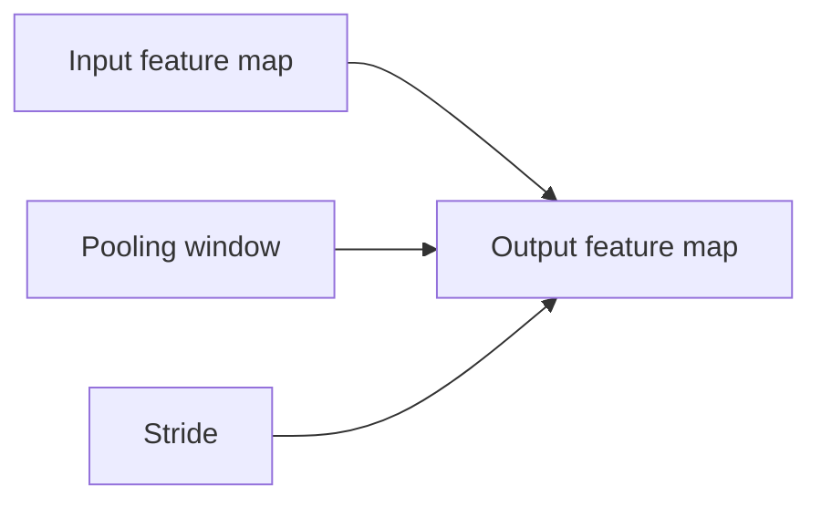

# Week 11 — Day 5
## Pooling Layers: Max Pooling, Average Pooling, and Spatial Downsampling

## 📚 Topics

1. Review of convolution output shapes from Day 4
2. Why CNNs use pooling layers
3. Max pooling intuition
4. Average pooling intuition
5. How pooling changes height and width
6. Pooling vs convolution
7. PyTorch `nn.MaxPool2d` and `nn.AvgPool2d`
8. Common pooling shape mistakes

<br>

---

<br>

## 🎯 Learning Goals

By the end of **Week 11, Day 5**, we should be able to:

1. Explain why pooling is used in CNNs.
2. Understand what max pooling does.
3. Understand what average pooling does.
4. Calculate simple pooling output sizes.
5. Explain why pooling reduces height and width but usually keeps channels the same.
6. Use `nn.MaxPool2d` in PyTorch.
7. Recognize where pooling usually appears in a CNN.
8. Avoid common pooling shape mistakes.

<br>

---

<br>

# 1. 🔁 Review From Day 4

In Day 4, we learned how convolution output size is controlled by:

```text
kernel_size
stride
padding
```

For `nn.Conv2d`, the shape pattern is:

```text
[N, C_in, H_in, W_in] → [N, C_out, H_out, W_out]
```

Example:

```python
nn.Conv2d(in_channels=1, out_channels=8, kernel_size=3, stride=1, padding=1)
```

Input:

```text
[4, 1, 28, 28]
```

Output:

```text
[4, 8, 28, 28]
```

The batch size stays the same.

The channel count becomes `out_channels`.

Height and width depend on kernel size, stride, and padding.

Day 5 introduces another common CNN operation:

```text
pooling
```

<br>

---

<br>

# 2. 🧠 Core Concept: Why Pooling Exists

Pooling reduces the spatial size of feature maps.

Spatial size means:

```text
height × width
```

Example:

```text
28 × 28 → 14 × 14
```

Pooling helps CNNs by:

```text
reducing computation
keeping the strongest signals
making the model less sensitive to tiny shifts
slowly shrinking feature maps before classification
```

The key idea is:

```text
Pooling summarizes small regions of a feature map.
```

<br>

---

<br>

# 3. 🔲 Max Pooling Intuition

Max pooling looks at a small region and keeps the largest value.

Example `2 × 2` region:

```text
1   3
2   8
```

Max pooling keeps:

```text
8
```

Why?

Because `8` is the strongest value in that local region.

In CNN terms, a stronger value usually means:

```text
the filter detected its pattern more strongly there
```

So max pooling keeps the strongest local signal.

<br>

---

<br>

# 4. 🧮 Max Pooling Example

Suppose we have a small `4 × 4` feature map:

```text
1   3   2   4
5   6   1   2
7   2   8   1
3   4   2   9
```

Use:

```text
kernel_size = 2
stride = 2
```

That means we look at non-overlapping `2 × 2` regions.

Top-left region:

```text
1   3
5   6
```

Max value:

```text
6
```

Top-right region:

```text
2   4
1   2
```

Max value:

```text
4
```

Bottom-left region:

```text
7   2
3   4
```

Max value:

```text
7
```

Bottom-right region:

```text
8   1
2   9
```

Max value:

```text
9
```

So the pooled output is:

```text
6   4
7   9
```

The shape changed from:

```text
4 × 4 → 2 × 2
```

<br>

---

<br>

# 5. 🧘 Average Pooling Intuition

Average pooling looks at a small region and keeps the average value.

Example `2 × 2` region:

```text
1   3
2   8
```

Average:

```text
(1 + 3 + 2 + 8) / 4 = 3.5
```

So average pooling produces:

```text
3.5
```

Average pooling summarizes the overall local signal.

Max pooling keeps the strongest local signal.

<br>

---

<br>

# 6. 🧩 Max Pooling vs Average Pooling

| Pooling Type | What It Keeps | Intuition |
|---|---|---|
| Max pooling | Largest value | strongest detected signal |
| Average pooling | Average value | overall local signal |

In many basic CNNs, max pooling is more common.

It is useful when we care about whether a feature was strongly detected somewhere in a small region.

<br>

---

<br>

# 7. 🔢 Pooling Output Shape

Pooling uses a formula similar to convolution.

For one spatial dimension:

```text
output_size = floor((input_size + 2 × padding - kernel_size) / stride) + 1
```

For common max pooling:

```python
nn.MaxPool2d(kernel_size=2, stride=2)
```

Input size:

```text
28
```

Formula:

```text
floor((28 + 2×0 - 2) / 2) + 1
= floor(26 / 2) + 1
= 13 + 1
= 14
```

So:

```text
28 × 28 → 14 × 14
```

<br>

---

<br>

# 8. 🧠 Core Shape Rule

For pooling, the batch size usually stays the same.

The channel count usually stays the same.

Height and width shrink.

Example:

```text
[4, 8, 28, 28] → [4, 8, 14, 14]
```

Meaning:

```text
4 images stay 4 images
8 channels stay 8 channels
28 height becomes 14
28 width becomes 14
```

Pooling works separately inside each channel.

It does not create new filters.

<br>

---

<br>

# 9. 🔗 Pooling vs Convolution

| Operation | Learns Weights? | Changes Channels? | Changes Height/Width? |
|---|---:|---:|---:|
| Convolution | Yes | Usually yes | Often yes |
| Pooling | No | Usually no | Usually yes |

A convolution layer has learnable weights.

A pooling layer does not learn weights.

Pooling simply applies a fixed rule:

```text
max
```

or:

```text
average
```

<br>

---

<br>

# 10. 🧭 Visual Intuition: Pooling

## 10.1 Max Pooling Flow


Simple interpretation:

```text
max pooling keeps the strongest local signal from each small region
```

<br>

## 10.2 Pooling Shape Flow



The output height and width depend on:

```text
input size
pooling window size
stride
```

<br>

---

<br>

# 11. 💻 PyTorch Example: MaxPool2d

```python
import torch
import torch.nn as nn

x = torch.randn(4, 8, 28, 28)

pool = nn.MaxPool2d(kernel_size=2, stride=2)

out = pool(x)

print("Input shape:", x.shape)
print("Output shape:", out.shape)
```

Expected output:

```text
Input shape: torch.Size([4, 8, 28, 28])
Output shape: torch.Size([4, 8, 14, 14])
```

Meaning:

```text
batch size stays 4
channels stay 8
height becomes 14
width becomes 14
```

<br>

---

<br>

# 12. 💻 PyTorch Example: Average Pooling

```python
import torch
import torch.nn as nn

x = torch.randn(4, 8, 28, 28)

pool = nn.AvgPool2d(kernel_size=2, stride=2)

out = pool(x)

print("Input shape:", x.shape)
print("Output shape:", out.shape)
```

Expected output:

```text
Input shape: torch.Size([4, 8, 28, 28])
Output shape: torch.Size([4, 8, 14, 14])
```

The shape change is the same as max pooling here.

The difference is the value selected from each region.

```text
MaxPool2d → keeps maximum value
AvgPool2d → keeps average value
```

<br>

---

<br>

# 13. 🔗 Typical CNN Pattern

A simple CNN often follows this pattern:

```text
Conv2d → ReLU → Pool
```

Example:

```python
block = nn.Sequential(
    nn.Conv2d(in_channels=1, out_channels=8, kernel_size=3, padding=1),
    nn.ReLU(),
    nn.MaxPool2d(kernel_size=2, stride=2)
)
```

If input shape is:

```text
[4, 1, 28, 28]
```

After convolution:

```text
[4, 8, 28, 28]
```

After ReLU:

```text
[4, 8, 28, 28]
```

After max pooling:

```text
[4, 8, 14, 14]
```

This is the first real CNN block pattern.

<br>

---

<br>

# 14. ⚠️ Common Pooling Mistakes

## Mistake 1: Thinking Pooling Learns Weights

Pooling does not learn filters.

It applies a fixed rule such as:

```text
max
```

or:

```text
average
```

<br>

## Mistake 2: Thinking Pooling Changes Channels

Pooling usually keeps the channel count the same.

Example:

```text
[4, 8, 28, 28] → [4, 8, 14, 14]
```

The `8` channels stay `8`.

<br>

## Mistake 3: Forgetting That Pooling Works Per Channel

If there are 8 feature maps, pooling is applied separately to each one.

It does not combine all 8 channels into one.

<br>

## Mistake 4: Flattening Too Early

A common CNN sequence is:

```text
Conv2d → ReLU → Pool → Conv2d → ReLU → Pool → Flatten → Linear
```

Flattening usually happens after convolution and pooling blocks, not before them.

<br>

---

<br>

# 15. 💻 Full Practice Code

```python
import torch
import torch.nn as nn

# --------------------------------------------------
# 1. Create fake CNN feature maps
# --------------------------------------------------

x = torch.randn(4, 8, 28, 28)
print("Original shape:", x.shape)

# --------------------------------------------------
# 2. Max pooling
# --------------------------------------------------

max_pool = nn.MaxPool2d(kernel_size=2, stride=2)
max_out = max_pool(x)
print("After MaxPool2d:", max_out.shape)

# --------------------------------------------------
# 3. Average pooling
# --------------------------------------------------

avg_pool = nn.AvgPool2d(kernel_size=2, stride=2)
avg_out = avg_pool(x)
print("After AvgPool2d:", avg_out.shape)

# --------------------------------------------------
# 4. Conv + ReLU + Pool block
# --------------------------------------------------

images = torch.randn(4, 1, 28, 28)

block = nn.Sequential(
    nn.Conv2d(in_channels=1, out_channels=8, kernel_size=3, padding=1),
    nn.ReLU(),
    nn.MaxPool2d(kernel_size=2, stride=2)
)

block_out = block(images)

print("CNN block input shape:", images.shape)
print("CNN block output shape:", block_out.shape)
```

Expected output shapes:

```text
Original shape: torch.Size([4, 8, 28, 28])
After MaxPool2d: torch.Size([4, 8, 14, 14])
After AvgPool2d: torch.Size([4, 8, 14, 14])
CNN block input shape: torch.Size([4, 1, 28, 28])
CNN block output shape: torch.Size([4, 8, 14, 14])
```

<br>

---

<br>

# 16. 🔁 Review / Connection

From Day 4:

```text
kernel_size, stride, and padding control spatial output size
```

From Day 5:

```text
pooling also uses a window and stride, but it does not learn weights
```

A convolution layer learns filters.

A pooling layer summarizes local regions.

Together, they help CNNs build useful feature maps while gradually reducing spatial size.

<br>

---

<br>

# 17. 📝 Mini Concept Check

## Question 1

Why do CNNs use pooling?

<br>

## Question 2

What does max pooling keep from each local region?

<br>

## Question 3

What does average pooling keep from each local region?

<br>

## Question 4

If input shape is:

```text
[4, 8, 28, 28]
```

and we use:

```python
nn.MaxPool2d(kernel_size=2, stride=2)
```

what is the output shape?

<br>

## Question 5

Does pooling usually change the number of channels?

<br>

## Question 6

Does pooling learn weights?

<br>

## Question 7

In this block:

```python
block = nn.Sequential(
    nn.Conv2d(1, 8, kernel_size=3, padding=1),
    nn.ReLU(),
    nn.MaxPool2d(kernel_size=2, stride=2)
)
```

If input shape is `[4, 1, 28, 28]`, what is the final output shape?

<br>

---

<br>

# 18. ✅ Answer Key

## Answer 1

CNNs use pooling to reduce spatial size, lower computation, keep strong signals, and make the model less sensitive to small shifts.

<br>

## Answer 2

Max pooling keeps the largest value from each local region.

<br>

## Answer 3

Average pooling keeps the average value from each local region.

<br>

## Answer 4

Output shape:

```text
[4, 8, 14, 14]
```

Reason:

```text
batch size stays 4
channels stay 8
28 × 28 becomes 14 × 14
```

<br>

## Answer 5

No. Pooling usually keeps the number of channels the same.

<br>

## Answer 6

No. Pooling does not learn weights.

It applies a fixed rule such as max or average.

<br>

## Answer 7

Final output shape:

```text
[4, 8, 14, 14]
```

Step by step:

```text
Input: [4, 1, 28, 28]
Conv2d with padding=1: [4, 8, 28, 28]
ReLU: [4, 8, 28, 28]
MaxPool2d: [4, 8, 14, 14]
```

<br>

---

<br>

# 19. ✅ Completion Criteria

We should consider Day 5 complete when we can confidently explain:

```text
why pooling exists
what max pooling does
what average pooling does
why pooling reduces height and width
why pooling usually keeps channels the same
why pooling does not learn weights
how MaxPool2d changes shape
where pooling appears in a CNN block
```

The most important Day 5 checkpoint is this:

```text
Pooling summarizes local regions, usually reducing height and width while keeping batch size and channels unchanged.
```