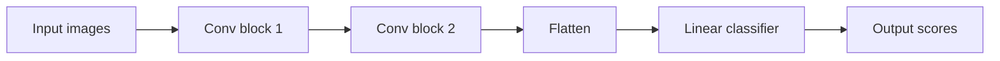

# Week 11 — Day 6
## Building a Small CNN in PyTorch

## 📚 Topics

1. Review of CNN building blocks from Days 1–5
2. CNN architecture pattern: `Conv2d → ReLU → Pool`
3. Stacking multiple CNN blocks
4. Flattening after convolution and pooling
5. Connecting CNN features to `nn.Linear`
6. Building a small CNN with `nn.Module`
7. Running a forward pass with fake image data
8. Debugging CNN shapes step by step

<br>

---

<br>

## 🎯 Learning Goals

By the end of **Week 11, Day 6**, we should be able to:

1. Build a small CNN class using `nn.Module`.
2. Use `nn.Conv2d`, `nn.ReLU`, and `nn.MaxPool2d` together.
3. Track image shape through CNN layers.
4. Understand when and why we flatten CNN outputs.
5. Connect flattened CNN features to a final `nn.Linear` layer.
6. Run a forward pass through a CNN.
7. Recognize common CNN shape errors.
8. Explain the purpose of each part of a simple CNN.

<br>

---

<br>

# 1. 🔁 Review From Days 1–5

So far in Week 11, we learned the key CNN ideas.

From Day 1:

```text
CNNs exist because images have local spatial structure.
```

From Day 2:

```text
PyTorch image tensors usually use [N, C, H, W].
```

From Day 3:

```text
Convolution uses learnable filters to scan local image patches.
```

From Day 4:

```text
kernel_size, stride, and padding control output height and width.
```

From Day 5:

```text
Pooling summarizes local regions and performs spatial downsampling.
```

Day 6 combines these ideas into our first small CNN.

<br>

---

<br>

# 2. 🧠 Core CNN Pattern

A common CNN block looks like this:

```text
Conv2d → ReLU → MaxPool2d
```

Meaning:

```text
Conv2d      learns filters and creates feature maps
ReLU        adds non-linearity
MaxPool2d   downsamples height and width
```

Example:

```python
nn.Sequential(
    nn.Conv2d(in_channels=1, out_channels=8, kernel_size=3, padding=1),
    nn.ReLU(),
    nn.MaxPool2d(kernel_size=2, stride=2)
)
```

If the input shape is:

```text
[4, 1, 28, 28]
```

then the block output shape is:

```text
[4, 8, 14, 14]
```

Step by step:

```text
Input:   [4, 1, 28, 28]
Conv2d:  [4, 8, 28, 28]
ReLU:    [4, 8, 28, 28]
Pool:    [4, 8, 14, 14]
```

<br>

---

<br>

# 3. 🧱 Stacking CNN Blocks

A CNN usually has more than one convolution block.

Example pattern:

```text
Block 1: Conv2d → ReLU → Pool
Block 2: Conv2d → ReLU → Pool
Flatten
Linear
```

Why stack blocks?

Early layers detect simpler patterns:

```text
edges
corners
small textures
```

Later layers can combine those into larger patterns:

```text
shapes
object parts
more meaningful visual structures
```

So a CNN gradually moves from small local details to higher-level features.

<br>

---

<br>

# 4. 🔢 Shape Plan for a Small CNN

We will use fake grayscale image data shaped like MNIST-style images:

```text
[batch_size, channels, height, width]
```

Example:

```text
[4, 1, 28, 28]
```

Meaning:

```text
4 images
1 grayscale channel
28 height
28 width
```

We will build this CNN:

```text
Conv block 1: 1 channel  → 8 channels,  28×28 → 14×14
Conv block 2: 8 channels → 16 channels, 14×14 → 7×7
Flatten
Linear classifier
```

Final shape before flattening:

```text
[4, 16, 7, 7]
```

Number of features per image after flattening:

```text
16 × 7 × 7 = 784
```

So the final linear layer needs:

```python
nn.Linear(16 * 7 * 7, 10)
```

The `10` can represent 10 output classes.

<br>

---

<br>

# 5. 🧠 Core Concept: Flatten Happens After CNN Blocks

Before convolution, image data should stay as:

```text
[N, C, H, W]
```

After convolution and pooling blocks, we flatten before the final classifier.

Why?

Convolution and pooling work with image-shaped data.

`nn.Linear` expects feature vectors.

So the flow is:

```text
image tensor → CNN blocks → feature maps → flatten → linear classifier
```

Example:

```text
[4, 16, 7, 7] → [4, 784]
```

Meaning:

```text
4 images
784 learned features per image
```

<br>

---

<br>

# 6. 💻 Small CNN Code

```python
import torch
import torch.nn as nn

class SmallCNN(nn.Module):
    def __init__(self):
        super().__init__()

        self.features = nn.Sequential(
            nn.Conv2d(in_channels=1, out_channels=8, kernel_size=3, padding=1),
            nn.ReLU(),
            nn.MaxPool2d(kernel_size=2, stride=2),

            nn.Conv2d(in_channels=8, out_channels=16, kernel_size=3, padding=1),
            nn.ReLU(),
            nn.MaxPool2d(kernel_size=2, stride=2)
        )

        self.classifier = nn.Linear(16 * 7 * 7, 10)

    def forward(self, x):
        x = self.features(x)
        x = x.reshape(x.shape[0], -1)
        x = self.classifier(x)
        return x
```

This is our first complete CNN model class.

<br>

---

<br>

# 7. 🔍 Shape Walkthrough

Input:

```text
[4, 1, 28, 28]
```

After first convolution:

```text
[4, 8, 28, 28]
```

Reason:

```text
out_channels = 8
padding = 1 preserves height and width
```

After first ReLU:

```text
[4, 8, 28, 28]
```

Reason:

```text
ReLU changes values, not shape
```

After first max pooling:

```text
[4, 8, 14, 14]
```

Reason:

```text
MaxPool2d(kernel_size=2, stride=2) halves height and width
```

After second convolution:

```text
[4, 16, 14, 14]
```

Reason:

```text
out_channels = 16
padding = 1 preserves height and width
```

After second ReLU:

```text
[4, 16, 14, 14]
```

After second max pooling:

```text
[4, 16, 7, 7]
```

After flatten:

```text
[4, 784]
```

Reason:

```text
16 × 7 × 7 = 784
```

After final linear layer:

```text
[4, 10]
```

Meaning:

```text
4 images
10 output scores per image
```

<br>

---

<br>

# 8. 🧭 Visual Model Flow



Shape flow:

```text
[4, 1, 28, 28]
→ [4, 8, 14, 14]
→ [4, 16, 7, 7]
→ [4, 784]
→ [4, 10]
```

<br>

---

<br>

# 9. 💻 Forward Pass Practice

```python
import torch

model = SmallCNN()

images = torch.randn(4, 1, 28, 28)

outputs = model(images)

print("Input shape:", images.shape)
print("Output shape:", outputs.shape)
```

Expected output:

```text
Input shape: torch.Size([4, 1, 28, 28])
Output shape: torch.Size([4, 10])
```

The output shape `[4, 10]` means:

```text
4 images
10 class scores per image
```

These are raw scores, also called logits.

They are not probabilities yet.

<br>

---

<br>

# 10. 🧪 Debugging Shapes Inside `forward()`

When building CNNs, shape debugging is very useful.

We can temporarily print shapes inside `forward()`:

```python
class SmallCNNDebug(nn.Module):
    def __init__(self):
        super().__init__()

        self.features = nn.Sequential(
            nn.Conv2d(1, 8, kernel_size=3, padding=1),
            nn.ReLU(),
            nn.MaxPool2d(2),
            nn.Conv2d(8, 16, kernel_size=3, padding=1),
            nn.ReLU(),
            nn.MaxPool2d(2)
        )

        self.classifier = nn.Linear(16 * 7 * 7, 10)

    def forward(self, x):
        print("Input:", x.shape)

        x = self.features[0](x)
        print("After conv1:", x.shape)

        x = self.features[1](x)
        print("After relu1:", x.shape)

        x = self.features[2](x)
        print("After pool1:", x.shape)

        x = self.features[3](x)
        print("After conv2:", x.shape)

        x = self.features[4](x)
        print("After relu2:", x.shape)

        x = self.features[5](x)
        print("After pool2:", x.shape)

        x = x.reshape(x.shape[0], -1)
        print("After flatten:", x.shape)

        x = self.classifier(x)
        print("After classifier:", x.shape)

        return x
```

Practice run:

```python
model = SmallCNNDebug()
images = torch.randn(4, 1, 28, 28)
outputs = model(images)
```

Expected shape path:

```text
Input: torch.Size([4, 1, 28, 28])
After conv1: torch.Size([4, 8, 28, 28])
After relu1: torch.Size([4, 8, 28, 28])
After pool1: torch.Size([4, 8, 14, 14])
After conv2: torch.Size([4, 16, 14, 14])
After relu2: torch.Size([4, 16, 14, 14])
After pool2: torch.Size([4, 16, 7, 7])
After flatten: torch.Size([4, 784])
After classifier: torch.Size([4, 10])
```

<br>

---

<br>

# 11. ⚠️ Common CNN Build Mistakes

## Mistake 1: Flattening Before Convolution

Wrong:

```text
[4, 1, 28, 28] → [4, 784] → Conv2d
```

Correct:

```text
[4, 1, 28, 28] → Conv2d → Pool → Flatten → Linear
```

`nn.Conv2d` expects:

```text
[N, C, H, W]
```

<br>

## Mistake 2: Wrong `in_channels`

If input is grayscale:

```text
[4, 1, 28, 28]
```

then first convolution needs:

```python
nn.Conv2d(in_channels=1, ...)
```

If input is RGB:

```text
[4, 3, 28, 28]
```

then first convolution needs:

```python
nn.Conv2d(in_channels=3, ...)
```

<br>

## Mistake 3: Wrong Second Convolution `in_channels`

If first convolution outputs 8 channels:

```python
nn.Conv2d(1, 8, kernel_size=3, padding=1)
```

then the next convolution must receive 8 input channels:

```python
nn.Conv2d(8, 16, kernel_size=3, padding=1)
```

The second layer's `in_channels` must match the previous layer's `out_channels`.

<br>

## Mistake 4: Wrong Linear Input Size

If final feature map shape is:

```text
[4, 16, 7, 7]
```

then each image has:

```text
16 × 7 × 7 = 784 features
```

So the classifier should be:

```python
nn.Linear(16 * 7 * 7, 10)
```

If this number is wrong, PyTorch will raise a matrix multiplication shape error.

<br>

---

<br>

# 12. 💻 Full Practice Code

```python
import torch
import torch.nn as nn

class SmallCNN(nn.Module):
    def __init__(self):
        super().__init__()

        self.features = nn.Sequential(
            nn.Conv2d(in_channels=1, out_channels=8, kernel_size=3, padding=1),
            nn.ReLU(),
            nn.MaxPool2d(kernel_size=2, stride=2),

            nn.Conv2d(in_channels=8, out_channels=16, kernel_size=3, padding=1),
            nn.ReLU(),
            nn.MaxPool2d(kernel_size=2, stride=2)
        )

        self.classifier = nn.Linear(16 * 7 * 7, 10)

    def forward(self, x):
        x = self.features(x)
        x = x.reshape(x.shape[0], -1)
        x = self.classifier(x)
        return x


model = SmallCNN()

images = torch.randn(4, 1, 28, 28)
outputs = model(images)

print("Input shape:", images.shape)
print("Output shape:", outputs.shape)
print(model)
```

Expected output shape:

```text
Input shape: torch.Size([4, 1, 28, 28])
Output shape: torch.Size([4, 10])
```

<br>

---

<br>

# 13. 🔁 Review / Connection

From Week 10, we already know this model structure:

```python
class ModelName(nn.Module):
    def __init__(self):
        super().__init__()

    def forward(self, x):
        return x
```

Day 6 adds CNN-specific layers:

```text
Conv2d
ReLU
MaxPool2d
Flatten
Linear
```

The training loop later will still use the same Week 10 pattern:

```text
forward pass
loss
zero_grad
backward
optimizer step
```

So the model changed, but the training workflow remains familiar.

<br>

---

<br>

# 14. 📝 Mini Concept Check

## Question 1

Why do we usually flatten after convolution and pooling blocks, not before?

<br>

## Question 2

If input shape is:

```text
[4, 1, 28, 28]
```

and the first convolution is:

```python
nn.Conv2d(1, 8, kernel_size=3, padding=1)
```

what is the output shape before pooling?

<br>

## Question 3

After this layer:

```python
nn.MaxPool2d(kernel_size=2, stride=2)
```

what does `[4, 8, 28, 28]` become?

<br>

## Question 4

If the final CNN feature map is:

```text
[4, 16, 7, 7]
```

how many flattened features does each image have?

<br>

## Question 5

Why does the final layer use this?

```python
nn.Linear(16 * 7 * 7, 10)
```

<br>

## Question 6

If the first convolution outputs 8 channels, what should the second convolution's `in_channels` be?

<br>

---

<br>

# 15. ✅ Answer Key

## Answer 1

We flatten after convolution and pooling because `nn.Conv2d` needs image-shaped input:

```text
[N, C, H, W]
```

After CNN blocks create feature maps, we flatten them so they can go into `nn.Linear`.

<br>

## Answer 2

Output shape:

```text
[4, 8, 28, 28]
```

Reason:

```text
batch size stays 4
out_channels = 8
padding=1 preserves 28 × 28
```

<br>

## Answer 3

It becomes:

```text
[4, 8, 14, 14]
```

Reason:

```text
MaxPool2d(kernel_size=2, stride=2) halves height and width
```

<br>

## Answer 4

Each image has:

```text
16 × 7 × 7 = 784 features
```

<br>

## Answer 5

Because after flattening, each image becomes a vector with 784 features.

The `10` means the model outputs 10 class scores.

<br>

## Answer 6

The second convolution's `in_channels` should be:

```text
8
```

because the previous convolution produced 8 output channels.

<br>

---

<br>

# 16. ✅ Completion Criteria

We should consider Day 6 complete when we can confidently explain:

```text
how to build a small CNN with nn.Module
why CNNs use Conv2d, ReLU, and MaxPool2d blocks
why flattening happens after CNN blocks
how to calculate the Linear input size
why second Conv2d in_channels must match previous out_channels
how to run a forward pass with fake image data
how to debug CNN shapes step by step
```

The most important Day 6 checkpoint is this:

```text
A small CNN turns image-shaped input into feature maps, flattens those features, and sends them into a final linear classifier.
```
