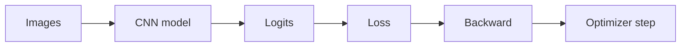

# Week 11 — Day 7
## Tiny CNN Training Workflow: Loss, Optimizer, Training Loop, and Evaluation

## 📚 Topics

1. Review of the small CNN from Day 6
2. What model output logits mean
3. Choosing a loss function for multi-class classification
4. Using an optimizer with a CNN
5. Creating fake image data and labels
6. Writing a basic CNN training loop
7. Using `model.train()` and `model.eval()`
8. Evaluating predictions and accuracy
9. Common CNN training mistakes

<br>

---

<br>

## 🎯 Learning Goals

By the end of **Week 11, Day 7**, we should be able to:

1. Connect the Day 6 CNN model to a training workflow.
2. Understand why CNN outputs are raw scores called logits.
3. Use `nn.CrossEntropyLoss()` for multi-class classification.
4. Use an optimizer to update CNN weights.
5. Write a small training loop for a CNN.
6. Understand the role of `zero_grad()`, `backward()`, and `step()`.
7. Evaluate predictions using `torch.argmax()`.
8. Explain how CNN training connects back to Week 10 PyTorch basics.

<br>

---

<br>

# 1. 🔁 Review From Day 6

In Day 6, we built a small CNN.

The model used this pattern:

```text
Conv2d → ReLU → MaxPool2d → Conv2d → ReLU → MaxPool2d → Flatten → Linear
```

Input shape:

```text
[4, 1, 28, 28]
```

Output shape:

```text
[4, 10]
```

Meaning:

```text
4 images
10 output scores per image
```

Those 10 output scores are called logits.

Day 7 connects this CNN model to a full training workflow.

<br>

---

<br>

# 2. 🧠 Core Concept: What Are Logits?

A CNN classifier does not directly output class names.

It outputs raw scores.

Example output for one image:

```text
[0.2, -1.1, 3.4, 0.8, -0.5, 1.2, 0.0, 2.1, -0.9, 0.4]
```

These are logits.

The highest logit represents the model's current predicted class.

Example:

```text
class 2 has the highest score: 3.4
```

So the predicted class is:

```text
2
```

In PyTorch, we can get that using:

```python
predictions = torch.argmax(outputs, dim=1)
```

Important:

```text
logits are raw scores, not probabilities
```

<br>

---

<br>

# 3. 🎯 Multi-Class Classification Loss

For a 10-class image classifier, we use:

```python
nn.CrossEntropyLoss()
```

This loss expects two things:

```text
model outputs: [batch_size, number_of_classes]
labels:        [batch_size]
```

Example:

```text
outputs shape = [4, 10]
labels shape  = [4]
```

The labels are class indexes, not one-hot vectors.

Example labels:

```text
[2, 0, 7, 4]
```

Meaning:

```text
image 1 belongs to class 2
image 2 belongs to class 0
image 3 belongs to class 7
image 4 belongs to class 4
```

<br>

---

<br>

# 4. 🔗 CNN Training Still Uses the Week 10 Pattern

Even though the model is now a CNN, the training process is the same PyTorch process from Week 10.

The core training step is:

```text
1. forward pass
2. calculate loss
3. zero gradients
4. backward pass
5. optimizer step
```

In code:

```python
outputs = model(images)
loss = criterion(outputs, labels)

optimizer.zero_grad()
loss.backward()
optimizer.step()
```

This is the same training logic we used earlier.

Only the model architecture changed.

<br>

---

<br>

# 5. 💻 Small CNN Model

```python
import torch
import torch.nn as nn

class SmallCNN(nn.Module):
    def __init__(self):
        super().__init__()

        self.features = nn.Sequential(
            nn.Conv2d(in_channels=1, out_channels=8, kernel_size=3, padding=1),
            nn.ReLU(),
            nn.MaxPool2d(kernel_size=2, stride=2),

            nn.Conv2d(in_channels=8, out_channels=16, kernel_size=3, padding=1),
            nn.ReLU(),
            nn.MaxPool2d(kernel_size=2, stride=2)
        )

        self.classifier = nn.Linear(16 * 7 * 7, 10)

    def forward(self, x):
        x = self.features(x)
        x = x.reshape(x.shape[0], -1)
        x = self.classifier(x)
        return x
```

Input:

```text
[N, 1, 28, 28]
```

Output:

```text
[N, 10]
```

<br>

---

<br>

# 6. 💻 Fake Data for Training Practice

We will use fake image data so we can focus on the training workflow.

```python
images = torch.randn(32, 1, 28, 28)
labels = torch.randint(0, 10, (32,))
```

Meaning:

```text
32 grayscale images
1 channel
28 height
28 width
32 labels
labels are integers from 0 to 9
```

Check shapes:

```python
print(images.shape)
print(labels.shape)
```

Expected output:

```text
torch.Size([32, 1, 28, 28])
torch.Size([32])
```

<br>

---

<br>

# 7. 💻 One Training Step

```python
model = SmallCNN()
criterion = nn.CrossEntropyLoss()
optimizer = torch.optim.Adam(model.parameters(), lr=0.001)

images = torch.randn(32, 1, 28, 28)
labels = torch.randint(0, 10, (32,))

model.train()

outputs = model(images)
loss = criterion(outputs, labels)

optimizer.zero_grad()
loss.backward()
optimizer.step()

print("Output shape:", outputs.shape)
print("Loss:", loss.item())
```

Expected output shape:

```text
Output shape: torch.Size([32, 10])
```

The loss value will vary because the data and labels are random.

<br>

---

<br>

# 8. 🧠 What Happens During This Step?

```python
outputs = model(images)
```

Runs the forward pass.

The CNN turns images into logits.

```python
loss = criterion(outputs, labels)
```

Compares model logits with the correct labels.

```python
optimizer.zero_grad()
```

Clears old gradients.

```python
loss.backward()
```

Computes gradients through the CNN.

```python
optimizer.step()
```

Updates the CNN weights.

That includes weights inside:

```text
Conv2d layers
Linear layer
```

Pooling and ReLU do not have learnable weights, but gradients still flow through them.

<br>

---

<br>

# 9. 🔁 Tiny Training Loop

```python
model = SmallCNN()
criterion = nn.CrossEntropyLoss()
optimizer = torch.optim.Adam(model.parameters(), lr=0.001)

images = torch.randn(32, 1, 28, 28)
labels = torch.randint(0, 10, (32,))

model.train()

for epoch in range(5):
    outputs = model(images)
    loss = criterion(outputs, labels)

    optimizer.zero_grad()
    loss.backward()
    optimizer.step()

    print(f"Epoch {epoch+1}, Loss: {loss.item():.4f}")
```

Because this uses fake random data, the loss is not meaningful as a real model-performance measure.

The point is to practice the training workflow.

<br>

---

<br>

# 10. 🧪 Evaluation With `model.eval()`

During evaluation, we use:

```python
model.eval()
```

and:

```python
with torch.no_grad():
```

Example:

```python
model.eval()

with torch.no_grad():
    outputs = model(images)
    predictions = torch.argmax(outputs, dim=1)
    accuracy = (predictions == labels).float().mean()

print("Predictions:", predictions)
print("Labels:", labels)
print("Accuracy:", accuracy.item())
```

Why `torch.no_grad()`?

```text
During evaluation, we do not need gradient tracking.
```

This saves memory and avoids unnecessary computation.

<br>

---

<br>

# 11. 🔍 Prediction Shape

If model output shape is:

```text
[32, 10]
```

then:

```python
predictions = torch.argmax(outputs, dim=1)
```

produces:

```text
[32]
```

Meaning:

```text
one predicted class per image
```

Example:

```text
outputs:      [32, 10]
predictions: [32]
labels:      [32]
```

Now predictions and labels can be compared directly.

<br>

---

<br>

# 12. 🧭 Visual Training Flow



Training loop idea:

```text
images → model → logits → loss → gradients → weight update
```

<br>

---

<br>

# 13. ⚠️ Common Training Mistakes

## Mistake 1: Using Wrong Label Shape

For `CrossEntropyLoss`, labels should be:

```text
[batch_size]
```

Not:

```text
[batch_size, num_classes]
```

So this is correct:

```text
labels = [2, 0, 7, 4]
```

One-hot labels are not needed for `nn.CrossEntropyLoss()`.

<br>

## Mistake 2: Applying Softmax Before CrossEntropyLoss

Do not apply softmax before `nn.CrossEntropyLoss()`.

Correct:

```python
loss = criterion(outputs, labels)
```

where `outputs` are raw logits.

`CrossEntropyLoss` internally handles the softmax-like calculation.

<br>

## Mistake 3: Forgetting `optimizer.zero_grad()`

Gradients accumulate by default in PyTorch.

So we should clear old gradients before each backward pass:

```python
optimizer.zero_grad()
```

<br>

## Mistake 4: Forgetting `model.eval()` During Evaluation

For evaluation, use:

```python
model.eval()
```

For training, use:

```python
model.train()
```

This becomes especially important when models include layers like dropout or batch normalization later.

<br>

## Mistake 5: Comparing Logits Directly to Labels

Wrong:

```python
outputs == labels
```

Correct:

```python
predictions = torch.argmax(outputs, dim=1)
accuracy = (predictions == labels).float().mean()
```

We compare predicted class indexes to label class indexes.

<br>

---

<br>

# 14. 💻 Full Practice Code

```python
import torch
import torch.nn as nn

class SmallCNN(nn.Module):
    def __init__(self):
        super().__init__()

        self.features = nn.Sequential(
            nn.Conv2d(in_channels=1, out_channels=8, kernel_size=3, padding=1),
            nn.ReLU(),
            nn.MaxPool2d(kernel_size=2, stride=2),

            nn.Conv2d(in_channels=8, out_channels=16, kernel_size=3, padding=1),
            nn.ReLU(),
            nn.MaxPool2d(kernel_size=2, stride=2)
        )

        self.classifier = nn.Linear(16 * 7 * 7, 10)

    def forward(self, x):
        x = self.features(x)
        x = x.reshape(x.shape[0], -1)
        x = self.classifier(x)
        return x


model = SmallCNN()
criterion = nn.CrossEntropyLoss()
optimizer = torch.optim.Adam(model.parameters(), lr=0.001)

images = torch.randn(32, 1, 28, 28)
labels = torch.randint(0, 10, (32,))

print("Images shape:", images.shape)
print("Labels shape:", labels.shape)
print()

model.train()

for epoch in range(5):
    outputs = model(images)
    loss = criterion(outputs, labels)

    optimizer.zero_grad()
    loss.backward()
    optimizer.step()

    print(f"Epoch {epoch+1}, Loss: {loss.item():.4f}")

model.eval()

with torch.no_grad():
    outputs = model(images)
    predictions = torch.argmax(outputs, dim=1)
    accuracy = (predictions == labels).float().mean()

print()
print("Output shape:", outputs.shape)
print("Prediction shape:", predictions.shape)
print("Accuracy:", accuracy.item())
```

Expected shapes:

```text
Images shape: torch.Size([32, 1, 28, 28])
Labels shape: torch.Size([32])
Output shape: torch.Size([32, 10])
Prediction shape: torch.Size([32])
```

<br>

---

<br>

# 15. 🔁 Review / Connection

The CNN model is more complex than a plain linear model, but the training workflow is the same PyTorch workflow from Week 10.

Same pattern:

```text
model.train()
forward pass
loss calculation
optimizer.zero_grad()
loss.backward()
optimizer.step()
```

Evaluation pattern:

```text
model.eval()
torch.no_grad()
forward pass
argmax predictions
accuracy calculation
```

So Week 11 builds on Week 10 rather than replacing it.

<br>

---

<br>

# 16. 📝 Mini Concept Check

## Question 1

What are logits?

<br>

## Question 2

For a 10-class classifier, what output shape should we expect for 32 images?

<br>

## Question 3

What shape should labels have for `nn.CrossEntropyLoss()` if batch size is 32?

<br>

## Question 4

Should we apply softmax before passing outputs into `nn.CrossEntropyLoss()`?

<br>

## Question 5

What are the three key lines that clear gradients, compute gradients, and update weights?

<br>

## Question 6

Why do we use `torch.argmax(outputs, dim=1)`?

<br>

## Question 7

Why do we use `torch.no_grad()` during evaluation?

<br>

---

<br>

# 17. ✅ Answer Key

## Answer 1

Logits are raw model output scores before converting them into probabilities.

For classification, the highest logit usually represents the predicted class.

<br>

## Answer 2

For 32 images and 10 classes, output shape should be:

```text
[32, 10]
```

<br>

## Answer 3

Labels should have shape:

```text
[32]
```

Each label is a class index from `0` to `9`.

<br>

## Answer 4

No.

We should pass raw logits directly into `nn.CrossEntropyLoss()`.

<br>

## Answer 5

The three key lines are:

```python
optimizer.zero_grad()
loss.backward()
optimizer.step()
```

Meaning:

```text
clear old gradients
compute new gradients
update weights
```

<br>

## Answer 6

We use:

```python
torch.argmax(outputs, dim=1)
```

to get the class index with the highest score for each image.

It converts output shape:

```text
[batch_size, num_classes]
```

into predictions shape:

```text
[batch_size]
```

<br>

## Answer 7

We use `torch.no_grad()` during evaluation because we do not need gradient tracking.

This saves memory and avoids unnecessary computation.

<br>

---

<br>

# 18. ✅ Completion Criteria

We should consider Day 7 complete when we can confidently explain:

```text
what logits are
why CrossEntropyLoss is used for multi-class classification
what shape model outputs should have
what shape labels should have
why we do not apply softmax before CrossEntropyLoss
how zero_grad, backward, and step work together
how to calculate predictions using argmax
how to evaluate a small CNN with accuracy
```

The most important Day 7 checkpoint is this:

```text
A CNN trains with the same PyTorch workflow as earlier models: forward pass, loss, gradients, optimizer step, then evaluation with argmax predictions.
```
